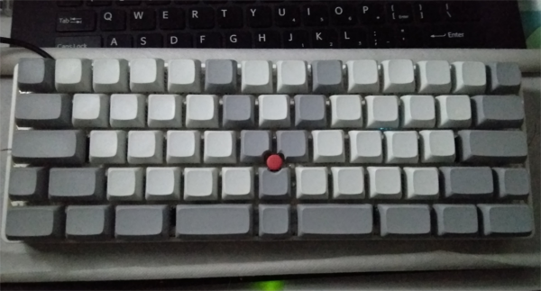
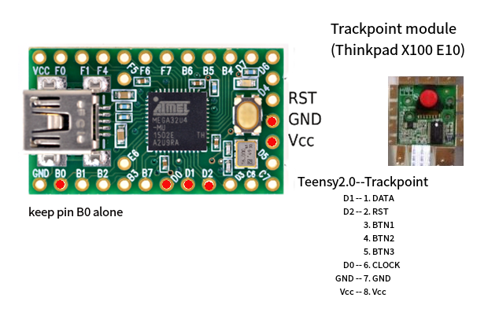
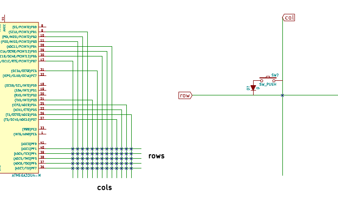

If you like this combination, you must know TEX Yoda, miniguru.

Nooooooo?

# Trackpoint & tmk-keyboard on teensy
---
### Do you wanna a customed layout keyboard (i.e., gh60) with trackpoint module working on it?

Okey, go aboard. this guide will show you how to DIY.

---

## Material

* [Teensy 2.0](https://www.pjrc.com/store/teensy.html)  # or later version if possible, never tried yet.
* Trackpoint # you have to make the pin assignments clear of your tp module
* Some other mechanical keyboard switches,...

You can get all of them from [taobao](https://www.taobao.com/).

## Firmware Tools

* [tmk_keyboard](https://github.com/tmk/tmk_keyboard)  # awesome project. You have to know how to build a kb(gh60) firemware.
* [teensyduino](https://www.pjrc.com/teensy/teensyduino.html)  # teensyduino is an add-on for the Arduino software. Please install arduino first.

Actually, I just convert [arduino-trackpoint-extended](https://github.com/rampadc/arduino-trackpoint-extended) project to c, and let it work on tmk env, nothing else. Thanks for the author sharing.

## Wiring Diagram

* teensy & trackpoint

* keyboard matrix

    cols: B7,B3,B2,B1,D3,C6,B6,B5,B4,D7,D5,D4,D6
    rols: F1,F4,F5,F6,F7

## Build Firmware

System required:

    apt install make avr-libc teensy-loader-cli

Command for build hex file: tp60_pjrc.hex

    cd teensy-trackpoint-tmk-keyboard
    make KEYMAP=tp -f Makefile.pjrc

And then, use [teensy loader](https://www.pjrc.com/teensy/loader.html).

### To be continue...

---

## References:

[Custom 65% finally finished](https://deskthority.net/workshop-f7/brownfox-step-by-step-t6050.html)

